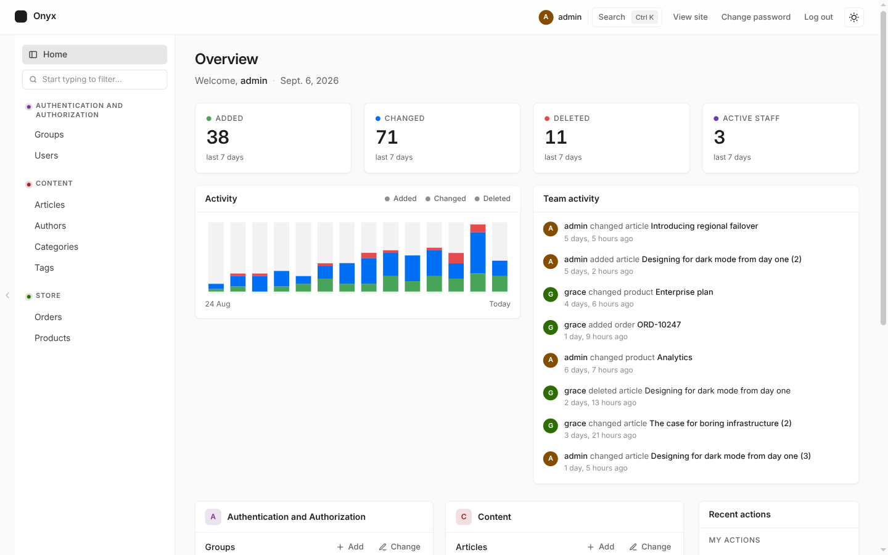
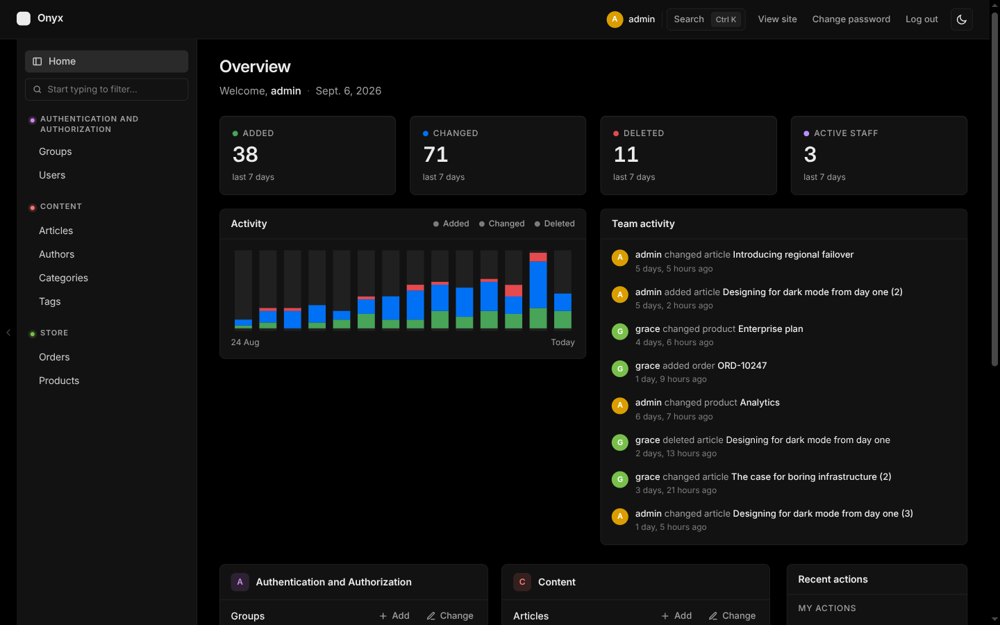
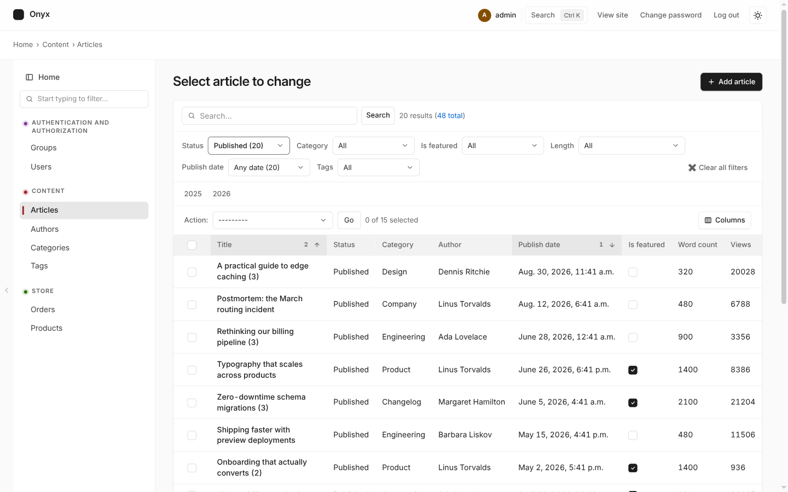
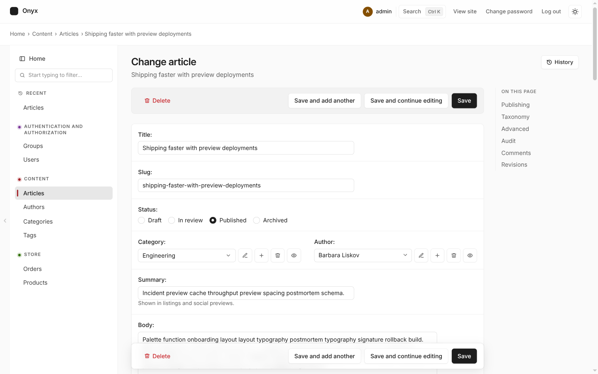
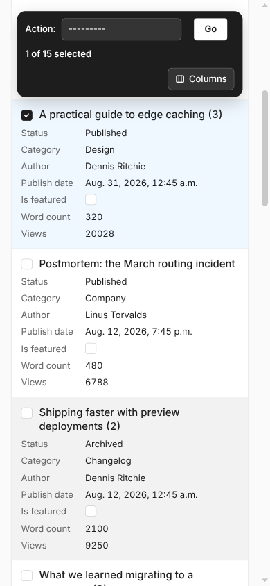
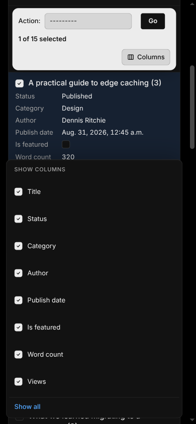

# django-onyx-admin

A modern, readable theme for the Django admin. Monochrome surfaces, one accent
colour, Inter for text, and a light and dark mode that follow Django's own
theme toggle. No build step, no JavaScript framework, and no rewrites of the
admin's form templates, which is what keeps it working across Django releases.

Works with Django 5.2 LTS, 6.0 and 6.1 on Python 3.10 to 3.14.





## Install

```bash
pip install django-onyx-admin
```

Put `onyx_admin` before `django.contrib.admin` in `INSTALLED_APPS`:

```python
INSTALLED_APPS = [
    "onyx_admin",
    "django.contrib.admin",
    # ...
]
```

Run `collectstatic` as usual. Nothing else is required.

## What you get

**Navigation**

- Left sidebar as the main menu, shown on the dashboard too. Groups collapse
  and remember their state, the current item carries its app's colour, and a
  quick "add" button appears on hover.
- Recently visited pages at the top of the sidebar.
- Command palette on `⌘K` / `Ctrl K`: every model, add form, recent page and
  header action. `/` focuses the list search box.
- On phones the sidebar becomes an off-canvas drawer that also carries the
  user links, so the header stays one row. List rows turn into cards with
  the title first and every column as a labelled line, so nothing scrolls
  sideways; on tablets the table scrolls with its selection and title columns
  pinned.

**Dashboard**

- Added / changed / deleted / active-staff tiles for the last week, a 14-day
  activity chart and a team activity feed, all from the admin log. One bounded
  query, filtered by the viewer's permissions. Disable with
  `ONYX_DASHBOARD_ACTIVITY = False`.
- Colour-coded app tiles with matching dots in the sidebar.

**Change lists**

- Filters render as dropdowns in a toolbar beside the search box.
- A Columns button hides or shows columns per model, remembered in the browser
  and applied before first paint.
- The action bar and column headers stay pinned under the header while you
  scroll; the bar restyles itself while rows are selected.
- Rows open on click, boolean icons sit in tinted circles, and empty results
  get a proper empty state.

**Change forms**

- Labels above fields, readable 14px text, custom checkboxes and radios, and
  boolean fields as toggle switches.
- An "On this page" section navigator on wide screens, a floating save bar
  that stays in view, an unsaved-changes indicator with a leave warning, and
  textareas that grow with their content.
- Every stock widget restyled: date and time shortcuts, calendar and clock
  pop-ups, `filter_horizontal`, autocomplete (Select2), raw id lookups,
  related-object buttons, file inputs, tabular and stacked inlines,
  collapsible fieldsets.





On phones, list rows become cards and the column chooser opens as a sheet
(light and dark):

<p>
  
  
</p>

**Login**

- A focused card with the brand, a show/hide password toggle, a Caps Lock
  warning, a double-submit guard with a loading state, and a matching
  logged-out page.

**Details**

- Inter (variable, with optical sizing) for text and Geist Mono for code,
  vendored under the SIL OFL and split by Unicode range so a page downloads
  only what it uses. Nothing loads from a CDN.
- Sends a CSP nonce on its stylesheet and scripts when the request has
  `csp_nonce` (Django 6 `SECURE_CSP` or django-csp).
- No hover effects that move things, no page transitions, and no layout
  shifts after first paint.

## Settings

| Setting | Default | Purpose |
| --- | --- | --- |
| `ONYX_FONT` | `"inter"` | `"geist"` for Geist Sans, `"system"` for the OS font |
| `ONYX_DASHBOARD_ACTIVITY` | `True` | Show the activity overview on the dashboard |

## Customising

**Site name.** Set `admin.site.site_header` and `admin.site.site_title` as
usual. The header shows the name with a small brand mark; hide the mark with
`--onyx-brand-mark-display: none`.

**Colours, radius, fonts.** Everything is driven by CSS custom properties.
Override them from a template that extends the theme's `base_site.html`:

```django


<style>
  :root, html[data-theme="light"] { --onyx-accent: #7c3aed; --onyx-radius: 4px; }
  html[data-theme="dark"] { --onyx-accent: #a78bfa; }
</style>

```

Useful properties: `--onyx-accent`, `--onyx-link`, `--onyx-primary-btn-bg`,
`--onyx-primary-btn-fg`, `--onyx-radius`, `--onyx-radius-lg`, `--onyx-font`,
`--onyx-mono`, `--onyx-sidebar-width`, `--onyx-content-padding`.

**Own `base_site.html`.** If your project already overrides
`admin/base_site.html`, extend `onyx_admin/base_site.html` instead of Django's
so the theme still loads. The `onyx_brand` block replaces the site name.

**Filters.** Filters render as `<select>` dropdowns through an override of
`admin/filter.html`. A filter that ships its own `template` keeps it and is
shown in the same toolbar; a bare text input there submits on Enter.

## Templates the theme overrides

| Template | Why |
| --- | --- |
| `admin/base_site.html` | loads the stylesheet last, tidies the user links |
| `admin/index.html` | sidebar on the dashboard, greeting, activity overview |
| `admin/nav_sidebar.html` | Home link, early script for recent pages and collapsed groups |
| `admin/app_list.html` | colour-coded app tiles (otherwise stock markup) |
| `admin/filter.html` | dropdown filters |
| `admin/login.html` | password toggle, Caps Lock hint, plain labels |
| `registration/logged_out.html` | logged-out card |
| `registration/password_change_*.html` | tidied user links on those two pages |

Everything else is untouched Django markup styled by one stylesheet.

## Browser support

Current Chrome, Edge, Firefox and Safari. The stylesheet uses `:has()`,
`color-mix()`, `oklch()` and CSS masks, all of which shipped in 2023.

## Development

```bash
uv venv && uv pip install -e . pytest pytest-django ruff
uv run python manage.py migrate
uv run python manage.py seed        # creates admin, grace and ada, password "admin"
uv run python manage.py runserver
uv run pytest && uv run ruff check .
```

The `demo/` project exercises every admin feature the theme styles. To test
another Django version, install it into the same environment, for example
`uv pip install "Django==6.1.*"`, and run `uv run pytest` again. CI runs the
suite on Django 5.2, 6.0 and 6.1 across Python 3.10 to 3.14.

## Licence

MIT. Inter and Geist are licensed under the SIL Open Font License 1.1; see
the licence files next to the font files.
